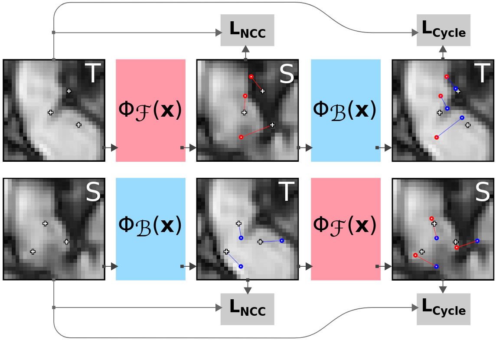
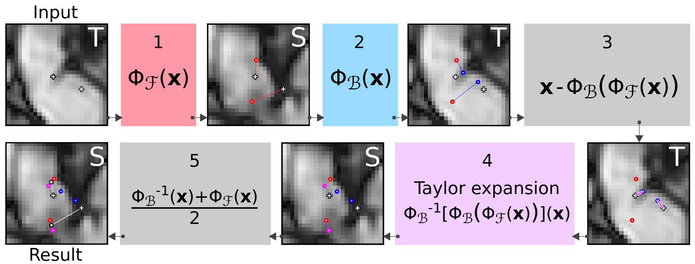
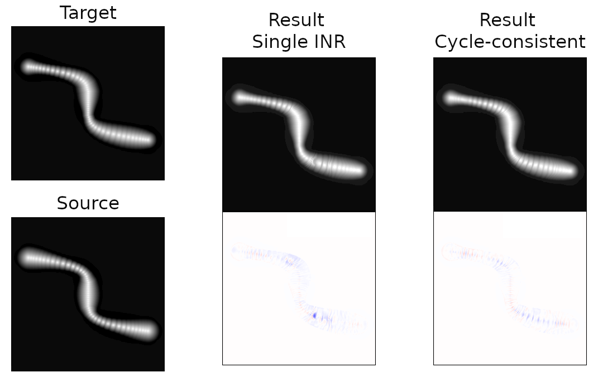

# Cycle-consistent implicit deformable image registration (ccIDIR)
Code for the paper _Robust deformable image registration using cycle-consistent implicit representations_, van Harten et al. 2023 ([link to the paper](https://ieeexplore.ieee.org/document/10268959), [arXiv](https://arxiv.org/a/vanharten_l_1.html)).

This method leverages cycle-consistency to improve the robustness and quality of deformable image registration with implicit neural representations. The method additionally yields an interpretable uncertainty metric which can be used for automatic quality control. 

# Optimization
The method optimizes a set of cycle-consistent registration INRs. These are MLPs that parameterize the transfer function from image coordinates to the corresponding deformation vector fields, as proposed in [Wolterink et al. 2022](https://proceedings.mlr.press/v172/wolterink22a.html). A schematic overview of the cycle-consistent optimization procedure is shown below:

# Inference
The optimized INRs can be treated as analytic functions, mapping arbitrary coordinates to deformation vectors. This means that, without any intermediate interpolation, we can use Taylor expansions on our Backward function to derive an estimated Forward function and vice versa. This means that, aside from stabilizing our optimization, we can use the second INR to derive a more accurate estimate of our desired registration: by inverting one of the functions, we can treat the set of INRs as a small ensemble, resulting in more accurate deformation estimates. On top of that, the disagreement between the two estimates can be used as a measure of uncertainty, which is valuable for automatic quality control. This inference procedure is shown below:

# Qualitative results
Cycle-consistent image registration is generally assumed to result in more plausible deformation estimates (as shown in e.g. Christensen & Johnson, 2001). Indeed, we observe this same effect when registering with cycle-consistent INRs. Below is an example of a simulated piece of small intestine with active peristalsis. While both results were optimized with the same regularization on the vector field, the deformations in the cycle-consistent results are much more anatomically plausible. For quantitative results, see [the paper](https://ieeexplore.ieee.org/document/10268959) ([arXiv](https://arxiv.org/a/vanharten_l_1.html)).

# Running the code
This repository includes a script that runs the method for images in the DIR-Lab dataset. To replicate the experiments, prepare the data as detailed in [the IDIR repository](https://github.com/MIAGroupUT/IDIR), make sure the DATA directory is correctly set in the run script (default: `~/DATA/DIRLAB`). Finally, run `python run_cycle_consistent.py #` where `#` is an optional case number that corresponds to a subject in the DIR-Lab set (default: 8).

# Reference
If you use this code, please cite the accompanying paper:

_This entry will be updated once the paper has been assigned an official publication date and volume number._

    @article{vanharten2023robust,
      title={Robust deformable image registration using cycle-consistent implicit representations},
      author={van Harten, Louis D. and Stoker, Jaap and I{\v{s}}gum, Ivana},
      journal={IEEE Transactions on Medical Imaging},
      volume={(in press)},
      number={},
      pages={},
      doi={10.1109/TMI.2023.3321425}
      year={2023},
      publisher={IEEE}
    }

